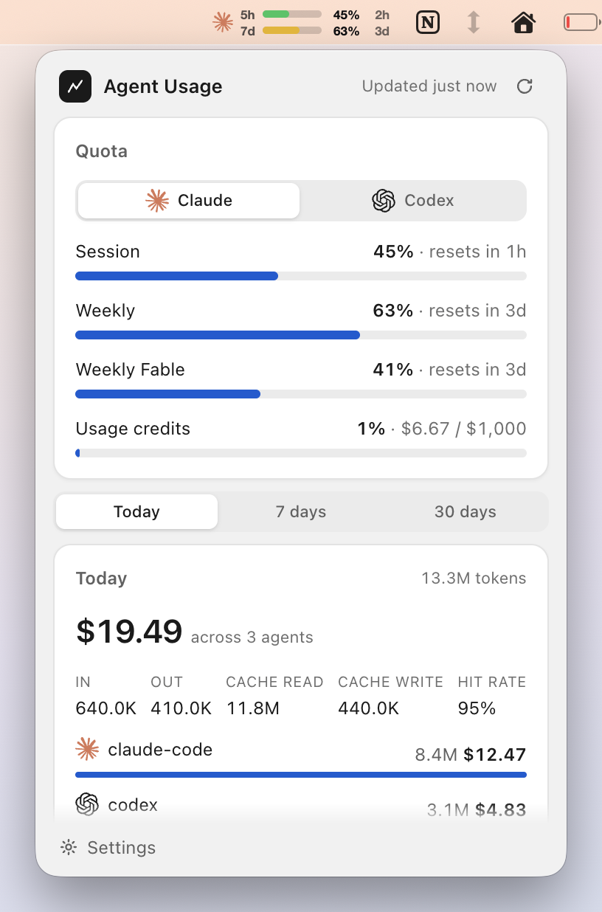

# Agent Usage

Agent Usage is a tray app for Windows and macOS. It shows your live Claude,
Codex, Copilot, Cursor and Gemini quotas. It also tracks tokens and cost across your AI coding agents. Everything
stays on your computer.

<p align="center">
  
</p>

## What it does

- **Shows your quotas in real time.** Claude: the 5-hour session limit, the
  weekly limits, and your usage credits. Codex: session and weekly windows.
  Copilot and Cursor: monthly allowance. Gemini CLI: daily requests per model. The tray icon changes color as you
  get close to a limit. Green means low use. Yellow means medium use. Red means
  high use.
- **Tracks cost across your agents.** It shows how many tokens and dollars you
  use in Claude Code, Codex, and Cursor.
- **Groups the cost many ways.** You can see the cost by agent, by model, by
  tool or MCP server, and by project.
- **Shows the burn rate.** It gives you the current tokens per minute and
  dollars per hour. It also estimates the time until you reach the session
  limit.
- **Draws your activity.** It shows the cost in each 5-hour block. It also draws
  a heatmap of your token use for each hour of the day.
- **Warns you.** It sends a system notification one time when you pass a limit
  that you set.
- **Adds an optional desktop widget.** On Windows the widget floats near the
  tray. It shows the session bar and the 7-day bar. On macOS the menu bar item
  shows the same two bars.

## Screenshots

| Popup (dark) | Settings | Widget (Windows) |
| --- | --- | --- |
|  |  |  |

**macOS.** The menu bar item shows the 5-hour and 7-day bars with the percent
and the reset time. The popup opens below it.

| Menu bar item | Menu bar item (dark) | Popup below the menu bar |
| --- | --- | --- |
|  |  |  |

## How it works

- **Quota data comes from the logins you already have.** Claude: the OAuth
  token in your local `~/.claude` folder (the Keychain on macOS), then the
  Anthropic usage API. Codex: `~/.codex/auth.json`, then the ChatGPT usage
  endpoint. GitHub Copilot: the editor plugin's `github-copilot/apps.json` or your `gh` CLI login, then
  `api.github.com/copilot_internal/user` (monthly premium requests). Cursor: the
  session token in Cursor's `state.vscdb`, then `cursor.com/api/usage-summary`
  (included usage per billing cycle). Gemini CLI: `~/.gemini/oauth_creds.json`,
  then the Code Assist quota endpoint (daily requests per model). Each provider
  shows only when its login exists; none of them is required.
- **Cost data comes from `tokscale`.** The app runs `tokscale` with `bunx` or
  `npx`. `tokscale` reads your local agent logs and calculates the tokens and
  the cost. You need `bun` or `node` on your computer for this feature.

The app sends no data to any server except those quota endpoints and the GitHub
release check. It stores no data in the cloud.

## Download

Get the latest build from the
[Releases page](https://github.com/antoniosumak/agent-usage-tray/releases/latest).

- **Windows:** `Agent Usage Setup x.y.z.exe`. Run it. The app installs for one
  user. It needs no admin rights. It adds a Start Menu shortcut, a desktop
  shortcut, and an uninstaller.
- **macOS:** `Agent Usage-x.y.z-arm64.dmg` for Apple Silicon or
  `Agent Usage-x.y.z-x64.dmg` for Intel. Open the DMG and drag the app to
  Applications. Zip builds are also available.

> The app is not signed. Windows SmartScreen shows "Unknown publisher". Click
> **More info**, then click **Run anyway**. On macOS, see the section below.

## macOS

- **First launch.** Gatekeeper blocks the app because it is not signed. Open
  **System Settings → Privacy & Security**, scroll to "Agent Usage was
  blocked", and click **Open Anyway**. Or right-click the app and choose
  **Open**. From a terminal, this does the same:
  `xattr -dr com.apple.quarantine "/Applications/Agent Usage.app"`
- **Keychain prompt.** Claude Code on macOS stores its login in the Keychain
  (service "Claude Code-credentials"). The app reads it with the `security`
  command. macOS asks once. Click **Always Allow**. If
  `~/.claude/.credentials.json` (or `$CLAUDE_CONFIG_DIR/.credentials.json`)
  exists, the app reads that file first. Codex reads `~/.codex/auth.json` as on
  Windows.
- **Menu bar item.** The app has no Dock icon. The menu bar item shows the same
  two rows as the Windows widget: the 5-hour bar and the 7-day bar, each with
  the percent and the reset time. Left-click opens the popup. Right-click shows
  **Quit**.
- **No auto-update.** macOS refuses unsigned updates. When a new version is out,
  the popup shows a **Download** link to the Releases page. Windows keeps
  auto-update.

## Build from source

```
npm ci
npm run dist        # Windows: the installer goes to release/
npm run dist:mac    # macOS: release/Agent Usage-<ver>-arm64.dmg (and x64)
```

## Cut a release

Bump the version in your PR. When it merges into `master`, GitHub Actions tags
`vX.Y.Z`, builds the Windows installer and the macOS DMGs in a matrix, and
publishes them in one release. A merge without a version bump releases nothing.

```
npm version patch --no-git-tag-version   # bumps package.json + package-lock.json
```
