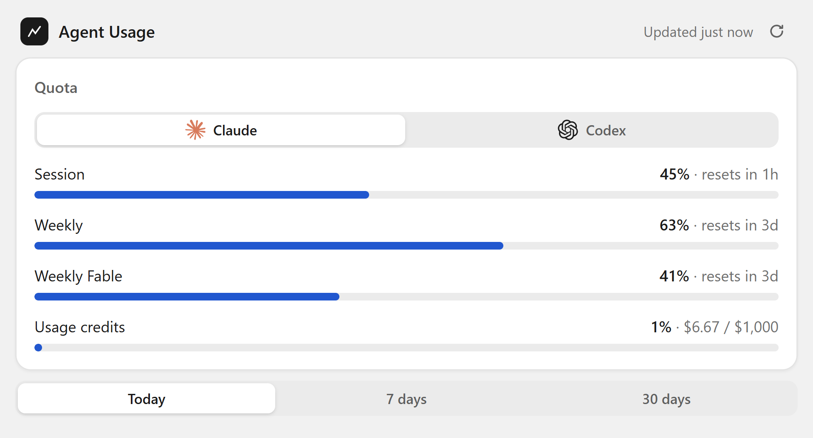
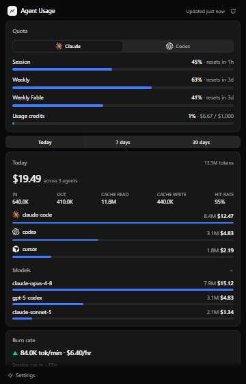
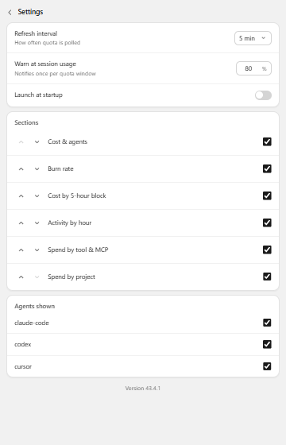
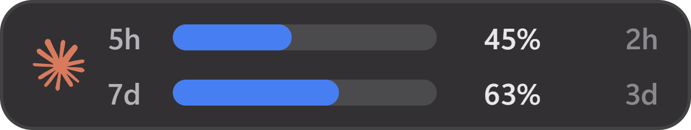

# Agent Usage

Agent Usage is a Windows tray app. It shows your live Claude quotas. It also
tracks tokens and cost across your AI coding agents. Everything stays on your
computer.

<p align="center">
  
</p>

## What it does

- **Shows your Claude quota in real time.** It reads the 5-hour session limit,
  the weekly limits, and your usage credits. The tray icon changes color as you
  get close to a limit. Green means low use. Yellow means medium use. Red means
  high use.
- **Tracks cost across your agents.** It shows how many tokens and dollars you
  use in Claude Code, Codex, and Cursor.
- **Groups the cost many ways.** You can see the cost by agent, by model, by
  tool or MCP server, and by project.
- **Shows the burn rate.** It gives you the current tokens per minute and
  dollars per hour. It also estimates the time until you reach the session
  limit.
- **Draws your activity.** It shows the cost in each 5-hour block. It also draws
  a heatmap of your token use for each hour of the day.
- **Warns you.** It sends a Windows notification one time when you pass a limit
  that you set.
- **Adds an optional desktop widget.** The widget floats near the tray. It shows
  the session bar and the 7-day bar.

## Screenshots

| Popup (dark) | Settings | Widget |
| --- | --- | --- |
|  |  |  |

## How it works

- **Quota data comes from your Claude Code login.** The app reads the OAuth
  token from your local `~/.claude` folder. It then calls the Anthropic usage
  API. If you are not logged in to Claude Code, the app shows no quota.
- **Cost data comes from `tokscale`.** The app runs `tokscale` with `bunx` or
  `npx`. `tokscale` reads your local agent logs and calculates the tokens and
  the cost. You need `bun` or `node` on your computer for this feature.

The app sends no data to any server except the Anthropic usage API. It stores no
data in the cloud.

## Download

Get the latest **Agent Usage Setup `x.y.z`.exe** from the
[Releases page](https://github.com/antoniosumak/agent-usage-tray/releases/latest).
Then run it. The app installs for one user. It needs no admin rights. It adds a
Start Menu shortcut, a desktop shortcut, and an uninstaller.

> The app is not signed yet. Windows SmartScreen shows "Unknown publisher".
> Click **More info**, then click **Run anyway**.

## Code signing

Free code signing is provided by [SignPath.io](https://signpath.io), with a
certificate from the [SignPath Foundation](https://signpath.org).

This program will not transfer any information to other networked systems
unless it is needed for the features above (the Anthropic and ChatGPT usage
APIs) or the person who operates it requests it.

## Build from source

```
npm ci
npm run dist    # the installer goes to release/
```

## Cut a release

Push a version tag. GitHub Actions builds the installer and publishes it.

```
npm version patch      # this bumps package.json and adds the tag vX.Y.Z
git push --follow-tags
```
